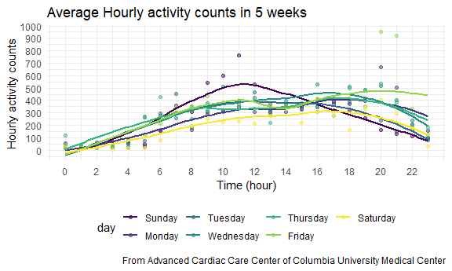

p8105\_hw3\_ls3751
================
Liucheng Shi

*packages required*

``` r
library(tidyverse)
library(p8105.datasets)

knitr::opts_chunk$set(
  fig.width = 6,
  fig.asp = .6,
  out.width = "90%"
)
theme_set(theme_minimal() + theme(legend.position = "bottom"))
options(
  ggplot2.continuous.colour = "viridis",
  ggplot2.continuous.fill = "viridis"
)
scale_colour_discrete = scale_colour_viridis_d
scale_fill_discrete = scale_fill_viridis_d
```

### Problem 1

``` r
data("instacart")
```

This dataset contains 1384617 rows and … columns.

Observations are the level of items in orders by user. There are user /
order variables – user ID, order ID, order day, and order hour. There
are also item variables – name, aisle, department, and some numeric
codes.

How many aisles, and which are most items from?

``` r
instacart %>% 
    count(aisle) %>% 
    arrange(desc(n))
```

    ## # A tibble: 134 x 2
    ##    aisle                              n
    ##    <chr>                          <int>
    ##  1 fresh vegetables              150609
    ##  2 fresh fruits                  150473
    ##  3 packaged vegetables fruits     78493
    ##  4 yogurt                         55240
    ##  5 packaged cheese                41699
    ##  6 water seltzer sparkling water  36617
    ##  7 milk                           32644
    ##  8 chips pretzels                 31269
    ##  9 soy lactosefree                26240
    ## 10 bread                          23635
    ## # ... with 124 more rows

Let’s make a plot

``` r
instacart %>% 
    count(aisle) %>% 
    filter(n > 10000) %>% 
    mutate(
        aisle = factor(aisle),
        aisle = fct_reorder(aisle, n)
    ) %>% 
    ggplot(aes(x = aisle, y = n)) + 
    geom_point() + 
    theme(axis.text.x = element_text(angle = 90, vjust = 0.5, hjust = 1))
```


Let’s make a table\!\!

``` r
instacart %>% 
    filter(aisle %in% c("baking ingredients", "dog food care", "packaged vegetables fruits")) %>% 
    group_by(aisle) %>% 
    count(product_name) %>% 
    mutate(rank = min_rank(desc(n))) %>% 
    filter(rank < 4) %>% 
    arrange(aisle, rank) %>% 
    knitr::kable()
```

| aisle                      | product\_name                                 |    n | rank |
| :------------------------- | :-------------------------------------------- | ---: | ---: |
| baking ingredients         | Light Brown Sugar                             |  499 |    1 |
| baking ingredients         | Pure Baking Soda                              |  387 |    2 |
| baking ingredients         | Cane Sugar                                    |  336 |    3 |
| dog food care              | Snack Sticks Chicken & Rice Recipe Dog Treats |   30 |    1 |
| dog food care              | Organix Chicken & Brown Rice Recipe           |   28 |    2 |
| dog food care              | Small Dog Biscuits                            |   26 |    3 |
| packaged vegetables fruits | Organic Baby Spinach                          | 9784 |    1 |
| packaged vegetables fruits | Organic Raspberries                           | 5546 |    2 |
| packaged vegetables fruits | Organic Blueberries                           | 4966 |    3 |

Apples vs ice cream..

``` r
instacart %>% 
    filter(product_name %in% c("Pink Lady Apples", "Coffee Ice Cream")) %>% 
    group_by(product_name, order_dow) %>% 
    summarize(mean_hour = mean(order_hour_of_day)) %>% 
    pivot_wider(
        names_from = order_dow,
        values_from = mean_hour
    )
```

    ## `summarise()` regrouping output by 'product_name' (override with `.groups` argument)

    ## # A tibble: 2 x 8
    ## # Groups:   product_name [2]
    ##   product_name       `0`   `1`   `2`   `3`   `4`   `5`   `6`
    ##   <chr>            <dbl> <dbl> <dbl> <dbl> <dbl> <dbl> <dbl>
    ## 1 Coffee Ice Cream  13.8  14.3  15.4  15.3  15.2  12.3  13.8
    ## 2 Pink Lady Apples  13.4  11.4  11.7  14.2  11.6  12.8  11.9

### Problem 2

#### 1.1 load the dataset and tidy data

``` r
accel_df = 
  read_csv("./data/accel_data.csv") %>% 
  janitor::clean_names() %>% 
  pivot_longer(
    activity_1:activity_1440, 
    names_to = "minute",
    names_prefix = "activity_", 
    values_to = "counts"
  )
```

#### 1.2 Create a variable that indicate the weekday/weekend status and modify variable formats

``` r
accel_df = accel_df %>% 
  mutate(
    weekday_weekend = case_when(
      day %in% c("Monday", "Tuesday", "Wednesday", "Thursday", "Friday") ~ "weekday",
      day %in% c("Saturday", "Sunday") ~ "weekend",
      TRUE ~ "")
      ) %>% 
  mutate(
    minute = as.numeric(minute),
    week = factor(week),
    day = forcats::fct_relevel(day, c("Sunday", "Monday", "Tuesday", "Wednesday", "Thursday", "Friday", "Saturday")
    )) %>% 
  relocate(weekday_weekend, .before = minute)
```

#### 1.3 Overview

After data cleaning and wrangling, this dataset has 50400 observations
with 6 variables, including week, day\_id, day, weekday\_weekend,
minute, counts.

  - *week\_id*: the week indicator ranging from 1 to 5.
  - *day\_id*: the day indicator ranging from 1 to 35 (5 weeks in
    total).
  - *day* & *weekday\_weekend*: ex: Sunday, weekend.
  - *minutes*: the recorded time (1440 min a day).
  - *counts*: the count of activities measured by accelerometer.

#### 2 Traditional analyses of accelerometer

``` r
accel_df %>% 
  group_by(week, day) %>% 
  summarise(activity_sum = sum(counts, na.rm = T)) %>% 
  pivot_wider(
   names_from = week,
   names_prefix = "week",
   values_from = activity_sum
  ) %>% 
  knitr::kable(digits = 1)
```

    ## `summarise()` regrouping output by 'week' (override with `.groups` argument)

| day       |    week1 |  week2 |  week3 |  week4 |  week5 |
| :-------- | -------: | -----: | -----: | -----: | -----: |
| Sunday    | 631105.0 | 422018 | 467052 | 260617 | 138421 |
| Monday    |  78828.1 | 295431 | 685910 | 409450 | 389080 |
| Tuesday   | 307094.2 | 423245 | 381507 | 319568 | 367824 |
| Wednesday | 340115.0 | 440962 | 468869 | 434460 | 445366 |
| Thursday  | 355923.6 | 474048 | 371230 | 340291 | 549658 |
| Friday    | 480542.6 | 568839 | 467420 | 154049 | 620860 |
| Saturday  | 376254.0 | 607175 | 382928 |   1440 |   1440 |

Besides the extreme large activity counts on Sunday Week 1 and two
extreme small counts on Saturdays Week 4 and 5, this table is not easy
to interpret and there is no apparent trend detected.

Ranking with the sum of activity counts.

``` r
accel_df %>% 
  group_by(week, day) %>% 
  summarise(activity_sum = sum(counts, na.rm = T)) %>% 
  mutate(rank = min_rank(desc(activity_sum))) %>% 
  select(-activity_sum) %>% 
  pivot_wider(
   names_from = week,
   names_prefix = "week",
   values_from = rank
  ) %>% 
  knitr::kable()
```

    ## `summarise()` regrouping output by 'week' (override with `.groups` argument)

| day       | week1 | week2 | week3 | week4 | week5 |
| :-------- | ----: | ----: | ----: | ----: | ----: |
| Sunday    |     1 |     6 |     4 |     5 |     6 |
| Monday    |     7 |     7 |     1 |     2 |     4 |
| Tuesday   |     6 |     5 |     6 |     4 |     5 |
| Wednesday |     5 |     4 |     2 |     1 |     3 |
| Thursday  |     4 |     3 |     7 |     3 |     2 |
| Friday    |     2 |     2 |     3 |     6 |     1 |
| Saturday  |     3 |     1 |     5 |     7 |     7 |

The table using ranks within the week is not easy to read neither.

#### 3 Make a single-panel plot that shows the 24-hour activity time courses for each day

``` r
accel_df %>% 
  group_by(week,day) %>%
  mutate(hour = floor((minute-1)/60)) %>%
  ungroup() %>% 
  group_by(week,day,hour) %>% 
  summarise(activity_mean = mean(counts, na.rm = T)) %>% 
  ggplot(aes(x = hour, y = activity_mean)) +
  geom_point(aes(color = day), alpha = .5)
```

    ## `summarise()` regrouping output by 'week', 'day' (override with `.groups` argument)



### Problem 3
